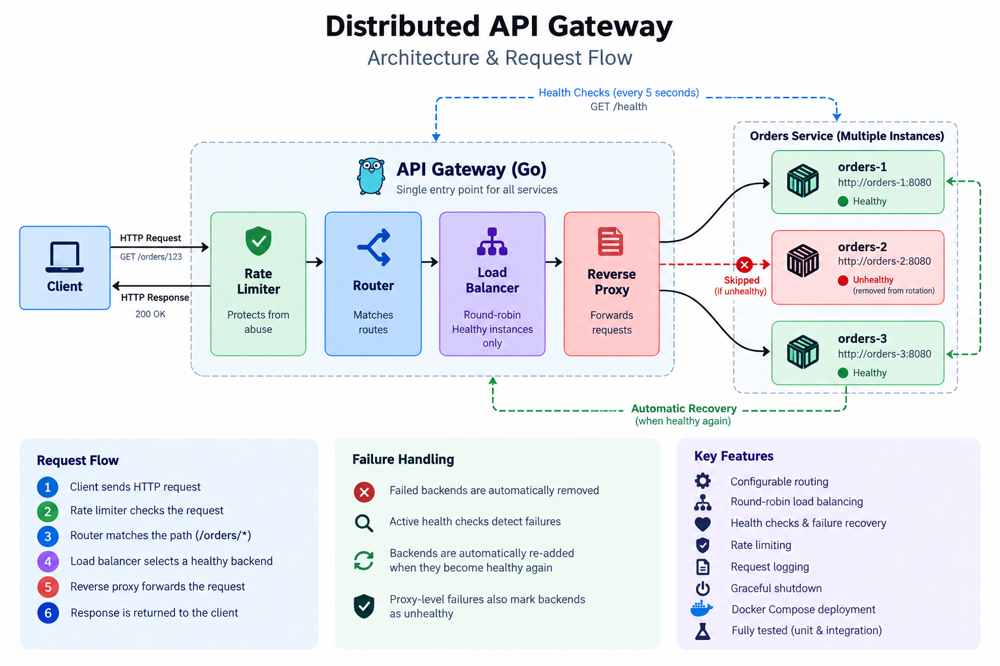

# Distributed API Gateway

A lightweight HTTP API Gateway built from scratch in Go.

The gateway acts as a single entry point for backend services and handles request routing, reverse proxying, round-robin load balancing, health monitoring, rate limiting, request logging, and graceful shutdown.

The system is containerized with Docker Compose and includes multiple instances of the same backend service to demonstrate load balancing and failure recovery.



---

## Overview

In a distributed application, clients should not need to know which backend instance is responsible for handling a request.

Instead, a gateway can sit between clients and backend services:

```text
Client
   |
   v
API Gateway
   |
   +----> orders-1
   |
   +----> orders-2
   |
   +----> orders-3
```

This project implements that gateway from scratch using Go's standard HTTP libraries and a small number of external dependencies.

The gateway:

1. Receives an HTTP request.
2. Applies rate limiting.
3. Matches the request path against the configured routes.
4. Selects a healthy backend using round-robin load balancing.
5. Forwards the request using an HTTP reverse proxy.
6. Detects backend failures.
7. Removes failed backends from rotation.
8. Continuously checks backend health.
9. Automatically allows recovered backends back into rotation.
10. Logs request and routing information.

---

## Architecture

The gateway is composed of several independent responsibilities:

```text
                    +----------------+
                    |     Client     |
                    +-------+--------+
                            |
                            | HTTP Request
                            v
                  +---------------------+
                  |    Rate Limiter    |
                  +----------+----------+
                             |
                             v
                  +---------------------+
                  |       Router        |
                  |                     |
                  | Path Matching       |
                  +----------+----------+
                             |
                             v
                  +---------------------+
                  |    Load Balancer    |
                  |                     |
                  | Round Robin         |
                  | Healthy Backends    |
                  +----------+----------+
                             |
                             v
                  +---------------------+
                  |    Reverse Proxy    |
                  +----------+----------+
                             |
                 +-----------+-----------+
                 |           |           |
                 v           v           v
             orders-1    orders-2    orders-3
```

Backend instances are monitored independently through health checks.

```text
                  API Gateway
                       |
             GET /health every 5s
                       |
          +------------+------------+
          |            |            |
          v            v            v
      orders-1     orders-2     orders-3
       healthy      healthy      unhealthy
                                    |
                                    v
                           removed from rotation
```

---

## Request Flow

For a request such as:

```http
GET /orders/123
```

the request passes through the gateway as follows:

### 1. Rate Limiting

The gateway first checks whether the request is allowed by the rate limiter.

If the limit has been exceeded:

```http
HTTP/1.1 429 Too Many Requests
```

The request is rejected without reaching a backend.

---

### 2. Route Matching

The router compares the request path with the configured routes.

Example configuration:

```json
{
  "routes": [
    {
      "path": "/orders",
      "targets": [
        "http://orders-1:8080",
        "http://orders-2:8080",
        "http://orders-3:8080"
      ]
    }
  ]
}
```

A request to:

```text
/orders/123
```

matches:

```text
/orders
```

The router uses the most specific matching route when multiple routes could match.

---

### 3. Load Balancing

Once a route has been selected, the gateway asks its load balancer for the next healthy backend.

The current implementation uses round-robin scheduling:

```text
Request 1 → orders-1
Request 2 → orders-2
Request 3 → orders-3
Request 4 → orders-1
Request 5 → orders-2
Request 6 → orders-3
```

The load balancer maintains an in-memory index representing the next position in the rotation.

A mutex protects this shared state because multiple HTTP requests can access the load balancer concurrently.

---

### 4. Reverse Proxy

After selecting a backend, the gateway creates an HTTP reverse proxy and forwards the request.

For example:

```text
Client
   |
   | GET /orders/123
   v
Gateway
   |
   | GET /orders/123
   v
orders-2:8080
```

The backend response is then returned to the client through the gateway.

---

## Health Checks

The gateway performs active health checks every 5 seconds.

Each backend exposes:

```text
GET /health
```

A successful response in the `2xx` range means the backend is considered healthy.

If the health check fails, the backend is marked unhealthy.

For example:

```text
orders-1 → healthy
orders-2 → unhealthy
orders-3 → healthy
```

The load balancer will then only select:

```text
orders-1
orders-3
orders-1
orders-3
...
```

### Why health checks are not enough

A health check introduces an unavoidable race condition.

For example:

```text
12:00:00.000  Health check succeeds
12:00:00.001  Backend crashes
12:00:00.002  Client request arrives
```

The gateway cannot know about the crash until the next health check.

For this reason, the gateway also performs reactive failure detection.

If the reverse proxy encounters a backend connection failure, the backend is immediately marked unhealthy.

This gives the system two mechanisms:

```text
Proactive detection
        +
Reactive detection
        ↓
Better failure handling
```

---

## Failure Recovery

When a backend becomes unavailable, it is removed from the load-balancing rotation.

Example:

```text
orders-1  ✓
orders-2  ✗
orders-3  ✓
```

Traffic continues:

```text
orders-1
orders-3
orders-1
orders-3
...
```

When the backend becomes available again, the health checker detects the successful `/health` response and marks it healthy.

Traffic can then return to:

```text
orders-1
orders-2
orders-3
```

No gateway restart is required.

---

## Rate Limiting

The gateway uses a token-bucket rate limiter.

The current configuration is:

```text
Rate: 5 requests/second
Burst: 10 requests
```

The burst allows a short spike of requests while maintaining an average rate over time.

Requests that exceed the available tokens receive:

```http
HTTP 429 Too Many Requests
```

The current limiter is local to a gateway process.

This keeps the implementation simple and appropriate for a single gateway instance.

A distributed production implementation could use shared state such as Redis when multiple gateway instances need to enforce a global limit.

---

## Request Logging

The gateway logs both routing decisions and completed requests.

Example:

```text
routing GET /orders/123 → http://orders-1:8080
GET /orders/123 → 200 → 612.3µs

routing GET /orders/123 → http://orders-2:8080
GET /orders/123 → 200 → 531.8µs
```

Backend failures are also logged:

```text
backend failure GET /orders/123 → http://orders-2:8080
```

This makes it possible to observe which backend handled a request and when failures occur.

---

## Graceful Shutdown

The gateway handles operating-system termination signals such as:

```text
SIGINT
SIGTERM
```

When shutdown begins, the server stops accepting new connections and waits for active requests to complete.

A five-second shutdown timeout prevents the gateway from waiting indefinitely for a request.

The shutdown flow is:

```text
SIGTERM
   |
   v
Stop accepting new requests
   |
   v
Wait for active requests
   |
   v
Maximum 5 seconds
   |
   v
Gateway stopped
```

This prevents active requests from being abruptly terminated whenever possible.

---

## Docker Architecture

The project uses Docker Compose to run the gateway and multiple backend instances.

```text
                    Docker Network
                         |
             +-----------+-----------+
             |                       |
             v                       v
       +-----------+          +-------------+
       |  gateway  |          | orders-1    |
       |   :8080   |          |    :8080    |
       +-----------+          +-------------+
             |                       |
             |              +--------+--------+
             |              |                 |
             v              v                 v
                         orders-2          orders-3
                          :8080             :8080
```

All backend containers run the same `orders` service.

They use different container instances rather than separate copies of the source code.

Docker Compose provides internal DNS, allowing the gateway to reach:

```text
http://orders-1:8080
http://orders-2:8080
http://orders-3:8080
```

The backend ports do not need to be exposed to the host because the gateway communicates with them through the Docker network.

Only the gateway is published to the host:

```text
localhost:8080
```

---

## Running the Project

### Requirements

* Go
* Docker
* Docker Compose

### Start the system

From the project root:

```bash
docker compose up --build
```

The gateway will be available at:

```text
http://localhost:8080
```

Test it with:

```bash
curl http://localhost:8080/orders/123
```

You should receive a response from one of the backend instances.

---

## Demonstrating Load Balancing

Send several requests:

```bash
curl http://localhost:8080/orders/123
curl http://localhost:8080/orders/123
curl http://localhost:8080/orders/123
curl http://localhost:8080/orders/123
curl http://localhost:8080/orders/123
```

The responses should rotate between:

```text
orders-1
orders-2
orders-3
orders-1
orders-2
```

This demonstrates the round-robin load balancer.

---

## Demonstrating Failure Recovery

Start the system:

```bash
docker compose up
```

Verify that requests are distributed across all three instances.

Then stop one backend:

```bash
docker compose stop orders-2
```

The gateway will initially be able to attempt a request against the failed instance.

The proxy failure will mark it unhealthy.

The health checker will also detect that the instance is unavailable.

Traffic will then continue through:

```text
orders-1
orders-3
orders-1
orders-3
...
```

Now restart the backend:

```bash
docker compose start orders-2
```

After a successful health check, `orders-2` becomes eligible for load balancing again.

The system returns to:

```text
orders-1
orders-2
orders-3
```

This demonstrates both **failure detection and automatic recovery**.

---

## Testing

Run the complete test suite:

```bash
go test ./...
```

The project includes tests for:

* Round-robin load balancing
* Skipping unhealthy backends
* Handling the case where no healthy backends exist
* HTTP request proxying
* Backend failure detection
* Rate limiting

The router tests use Go's `httptest` package to create temporary HTTP servers, allowing the gateway to be tested without requiring Docker containers.

---

## Project Structure

```text
api-gateway/
│
├── cmd/
│   └── gateway/
│       └── main.go
│
├── internal/
│   ├── config/
│   │   └── config.go
│   │
│   ├── loadbalancer/
│   │   ├── loadBalancer.go
│   │   └── loadBalancer_test.go
│   │
│   ├── middleware/
│   │   └── logging.go
│   │
│   ├── ratelimiter/
│   │   └── ratelimiter.go
│   │
│   └── router/
│       ├── router.go
│       └── router_test.go
│
├── configs/
│   ├── routes.json
│   └── routes.example.json
│
├── architecture.png
├── Dockerfile
├── docker-compose.yml
├── .env.example
├── go.mod
├── go.sum
└── README.md
```

---

## Technologies

* **Go** — HTTP server and application implementation
* **net/http** — HTTP server and client functionality
* **net/http/httputil** — reverse proxying
* **sync.Mutex** — protecting concurrent load-balancer state
* **golang.org/x/time/rate** — token-bucket rate limiting
* **httptest** — HTTP integration testing
* **Docker** — containerization
* **Docker Compose** — multi-container deployment

---

## Engineering Decisions

### In-memory load balancing

The load balancer maintains its state in memory because the gateway currently runs as a single instance.

This keeps the implementation simple and avoids introducing unnecessary infrastructure.

A multi-instance gateway deployment would require a different architecture depending on the desired consistency and coordination model.

### Round-robin

Round-robin was chosen because it is simple, predictable, and effective when backend instances have similar capacity.

More advanced strategies could consider latency, active connections, backend capacity, or weighted distribution.

### Health checks + reactive failure detection

Health checks provide proactive detection, while proxy failures provide immediate reaction to failures occurring between health-check intervals.

Using both reduces the amount of traffic sent to failed instances while acknowledging that backend availability can never be known perfectly in advance.

### Docker Compose

Docker Compose provides an easy way to reproduce a distributed environment locally.

Instead of maintaining three separate backend projects, the same backend image is instantiated three times.

---

## What This Project Demonstrates

This project was built to explore the engineering problems behind an API gateway rather than simply calling an existing gateway service.

It demonstrates practical experience with:

* HTTP request handling
* Reverse proxies
* Routing
* Concurrent state
* Mutex-based synchronization
* Load balancing
* Health monitoring
* Failure detection
* Failure recovery
* Rate limiting
* Middleware
* Graceful shutdown
* Automated testing
* Containerized services
* Service-to-service networking

---

## Future Improvements

Possible extensions include:

* Distributed rate limiting
* Weighted load balancing
* Per-route rate limits
* Metrics
* Distributed tracing
* Dynamic service discovery
* Configuration hot reload
* Authentication and authorization

These are intentionally outside the current implementation to keep the gateway focused on its core responsibilities.

---

## License

This project is intended as a personal engineering and learning project.
